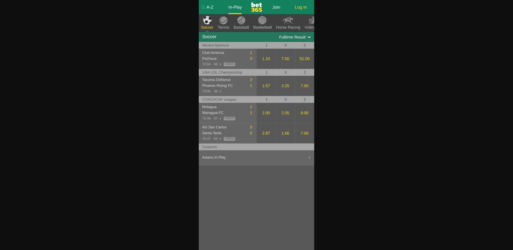
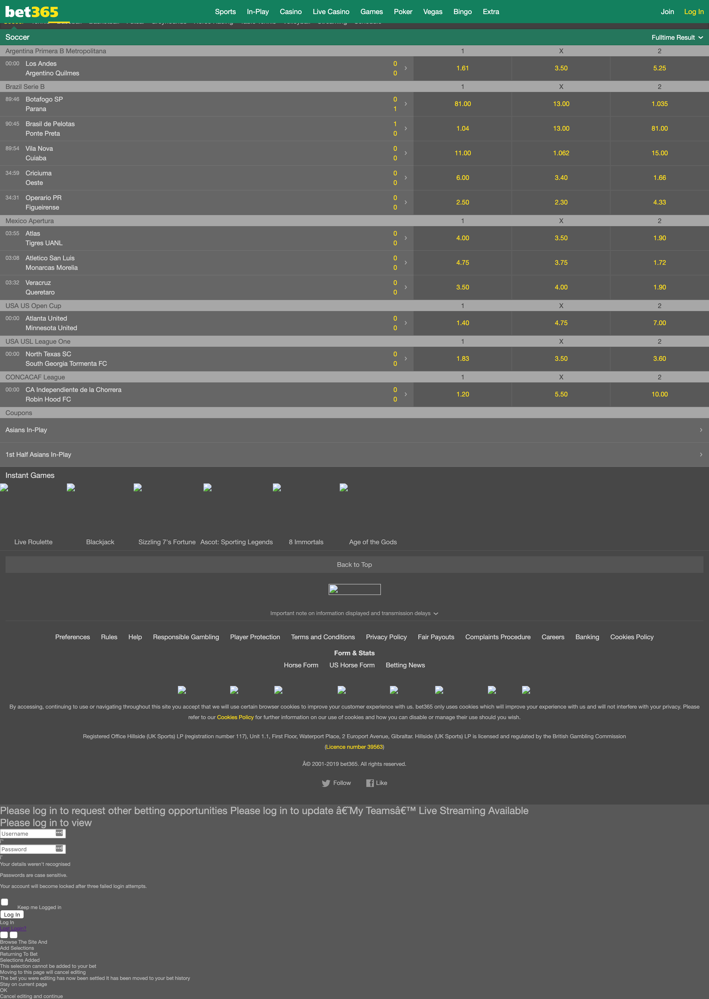
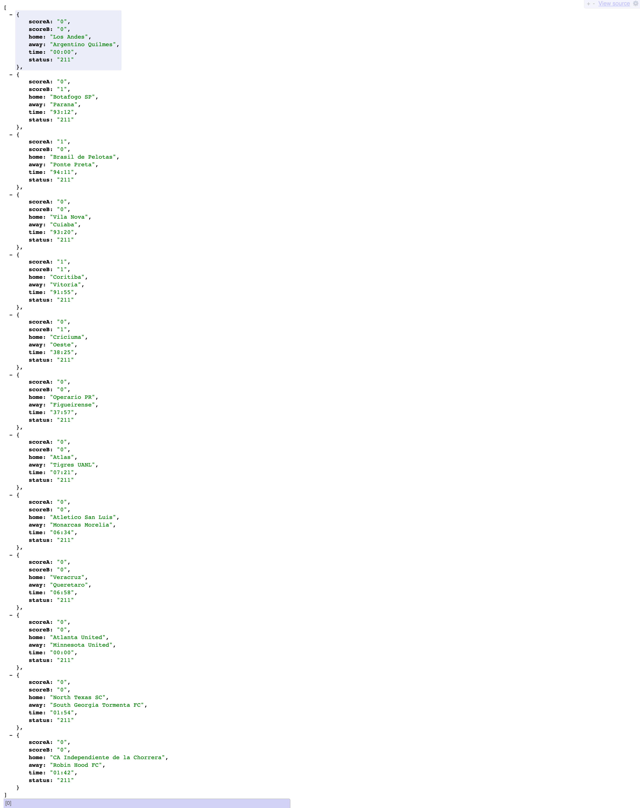
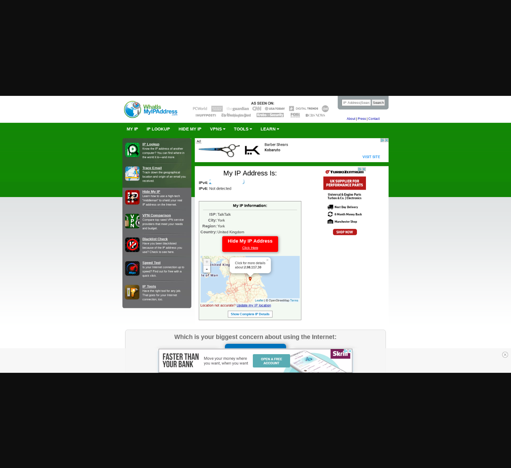

# bet365-live-soccer-scraper

Bet365 Live Soccer Score Scraper

## Config

Probably you should change config file `/app/config.js`.

```javascript
  domain: "mobile.288365.com",
  intervalTimes: {
    list: 1, // 1 sec.
    reload: 1200, // 60*20 = 20 min.
    proxy: 60 // 1 min.
  },
  proxyListAddr: "" // proxy list addr. http://blabla/proxy.json
```

The `proxyListAddr` address should be return like this because we need host, port, type, username and password for using the proxy. You can leave the address blank.

```javascript
[
  {
    host: "172.17.0.1",
    port: "6000",
    type: "http",
    username: "userr",
    password: "pwd"
  },
  {
    host: "172.17.0.2",
    port: "6002",
    type: "http",
    username: "userr",
    password: "pwd"
  }
];
```

The `intervalTimes`has 3 variables.
`list` process list interval time.
`reload` browser reload interval time. if you set to 0 this feature won't work.
`proxy` proxy list fetch interval time

```javascript
intervalTimes: {
    list: 1, // 1 sec.
    reload: 1200, // 60\*20 = 20 min.
    proxy: 60 // 1 min.
}
```

# How to Use?

## via Docker

Pls look at the `reload.sh` file.

## via npm

`cd app;npm install;npm start`

# URL's

`/connect` open a browser and connect to bet365

`/close` close browser

`/reload` close browser and connect to bet365

`/screenshot` it returns browser screenshot

`/showip` it opens `https://whatismyipaddress.com/` and returns the screenshot

`/params` it shows puppeter params.

`/proxyList` it returns proxy list

`/pickProxy/:id` You can choice proxy by id.

`/clearProxyParam` it removes proxy from params.You should reload browser for apply the changes.

`/html` it returns page html data

`/result` it returns results.

`/`it returns results. Status `212` means match's suspended.

## Notes

This software for education only. I don't take any responsibility.

You can get betting odds from bet365 if you change the parser codes in `bet365mobile.js`. It will be your responsibility.

## screen shots





